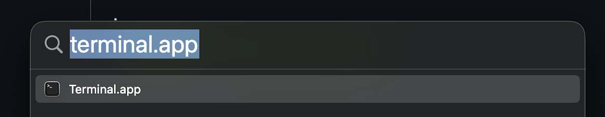

# RAM - Apple Silicon Wrapper

## Prerequisites

Make sure you buy the game from Steam or download the demo first.

## Install

1. Open `Terminal.app` (for example, by pressing `<Cmd-Space>`, typing "Terminal.app", and then pressing `<Enter>`).
    
2. Run the following commands in order (by copy-pasting each one into the app and pressing `<Enter>`):
    1. `git clone https://github.com/ethanuppal/RAM-AppleSiliconWrapper.app`
    2. `chmod u+x RAM-AppleSiliconWrapper.app/Contents/MacOS/RAM-AppleSiliconWrapper`
    3. `xattr -d com.apple.quarantine RAM-AppleSiliconWrapper.app` (this may print an error; if so, ignore it)
    4. `mv RAM-AppleSiliconWrapper.app /Applications/`

Now the app is fully installed.

## Usage

Simply open the app (either through Spotlight, manually, or some other means).
It will first look if the full app is installed and launch that.
Otherwise, it will look for the DEMO and launch that.

If RAM is not installed, you will get this popup:

